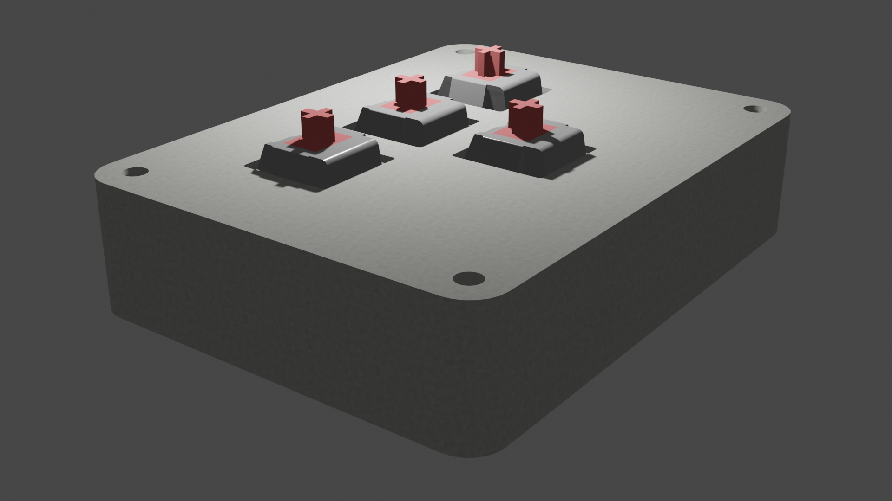

Here is the compact README with your three images included:

---

# **WASD Keypad with RGB Feedback (CircuitPython)**

A compact 4-button keypad that outputs `W`, `A`, `S`, `D` via USB HID and uses RGB LEDs for visual feedback. When idle, the LEDs run a smooth rainbow animation.

---

## **Images**

### **Render**

### **Schematic**

### **PCB**

---

## **Features**

* USB HID output for `W`, `A`, `S`, `D`
* Per-key LED color feedback
* Rainbow animation when no key is pressed
* Clean press/release handling

---

## **Hardware**

* CircuitPython board
* 4 buttons on pins D26–D29
* 2 NeoPixels on D2
* USB connection

---

## **Setup**

1. Install CircuitPython on the board
2. Copy `code.py`, `adafruit_hid`, and `neopixel` libs
3. Connect buttons to GND (pull-ups enabled)
